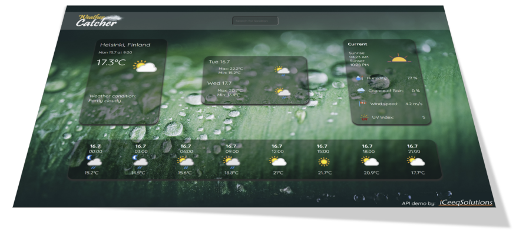

# Weather application demo with API connection.

  Weather Application Demo Page by <a href="https://iceeqsolutions.fi/">iCeeqSolutions</a>

## About

The weather application demo is an example of a web application featuring both dynamic content genereation and data fetching from an external API. For better code readability and control, each data container on the screen has been written as a separate module.

To access the API, credentials needs to be sent along with the data request. The credentials have been hidden behind the scenes in form of environment variables, which prevents misuse.

In order to boost page performance, we've used Webpack, which automatically compress and optimize the files before hosting them.

## Demo

👁️ [Live Demo](https://test.com)

## Built with

- JavaScript
- CSS
- Webpack
- NPM
- WeatherAPI.com
- ESLint
- Prettier

## Features

- Dynamic content generation
- Responsive design
- Environment variables
- Connection to external API
- Asynchronous data fetching
- Search functionality

  
